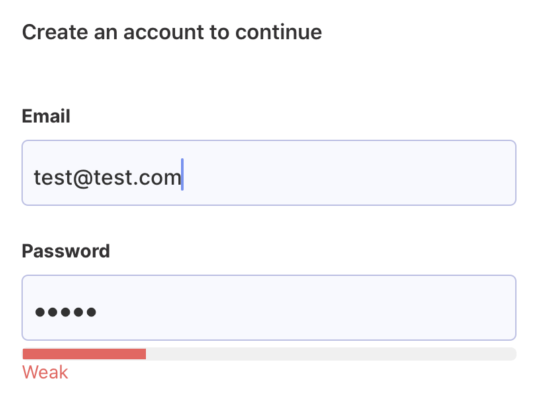

# react-native-password-strength-meter-bar

react-native-password-strength-meter-bar as the name implies is a component for showing password strength for iOS, Android and Expo workflow.

This component library uses zxcvbn password strength estimation library and react-native-progress
It supports react version >= 0.60 and <= 0.59.

- Component Demo



## Installation

Execute the command to install react-native-password-strength-meter-bar.

```bash
npm install --save react-native-password-strength-meter-bar
```

## How to use

Import react-native-password-strength-meter-bar.

```js
import PasswordStrengthMeterBar from 'react-native-password-strength-meter-bar';
```

Add the source code below to where you want to use it.

```js
return <PasswordStrengthMeterBar password={password} />;
```

## Properties

Below are react-native-password-strength-meter-bar properties.

| Prop             | required | Type    | Description                                                         | Default     |
| ---------------- | -------- | ------- | ------------------------------------------------------------------- | ----------- |
| password         | Yes      | String  | This is the password string for which the strength is being tested. | ""          |
| showStrenghtText | No       | Boolean | Text label for password strenght                                    | `true`      |
| height           | No       | Number  | Height of meter bar                                                 | 8           |
| radius           | No       | Number  | Border radius of meter bar                                          | 4           |
| unfilledColor    | No       | String  | Meter bar unfilled color                                            | `"#F0F0F0"` |

## Example code

You can see the example code and demo.

Clone the repository

```bash
git clone https://github.com/akinlekan28/react-native-password-strength-meter-bar.git
```

Install dependencies

```bash
cd example
npm install
```

Execute the example project

```bash
# example folder
# iOS
npm run ios
# Android
npm run android
```

## Contribute

You can follow below to contribute react-native-password-strength-meter-bar.

Clone the repository and create a pull request

```bash
git clone https://github.com/akinlekan28/react-native-password-strength-meter-bar.git
```
